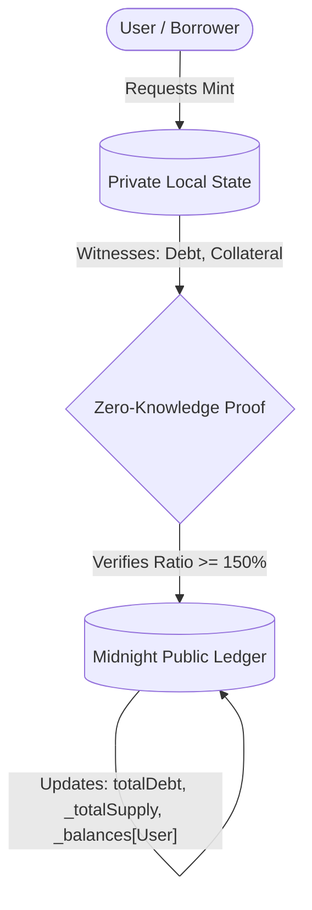

# pUSD: A Privacy-Preserving Collateralized Lending Protocol on Midnight

**Version:** 3.0.0  
**Date:** March 2026  
**Authors:** Midnight Network Protocol Engineers  

## Abstract

Decentralized finance (DeFi) has popularized collateralized lending and synthetic stablecoins, enabling open-access financial services. However, traditional transparent blockchains (e.g., Ethereum) broadcast all user position data—collateral amounts, outstanding debt, and liquidation thresholds—to the public ledger. This radical transparency introduces severe privacy limitations, enabling predatory behaviors such as widespread front-running, targeted liquidation hunting, and the deanonymization of users' financial portfolios. 

This paper introduces **pUSD**, a privacy-preserving collateralized synthetic stablecoin protocol built on the Midnight Network. By leveraging zero-knowledge (ZK) proofs and Compact smart contracts, pUSD enables users to mint a fungible, transferable stablecoin against deposited collateral while keeping their individual debt and collateral positions entirely confidential. v3 introduces oracle-driven price feeds, governance circuits, an insurance fund for bad debt absorption, emergency pause mechanisms, debt ceiling controls, and minimum debt enforcement, establishing the protocol as production-grade infrastructure for privacy-preserving DeFi.

---

## 1. Introduction

The advent of decentralized lending protocols, pioneered by systems such as MakerDAO and Aave, fundamentally shifted the paradigm of credit creation. By requiring overcollateralization rather than identity-based credit scoring, these systems digitized and democratized borrowing. Users lock volatile cryptographic assets as collateral to mint stability-pegged synthetic assets, unlocking liquidity while retaining exposure to the underlying asset.

Despite their success, the fundamental architecture of these legacy protocols relies on a fully transparent global state machine. Every transaction, collateral deposit, and debt accumulation is broadcast in plaintext. This absolute transparency creates asymmetric advantages for sophisticated network observers. Arbitrageurs routinely monitor mempools for vulnerable positions, executing precise transactions to force liquidations, while data aggregators map and track the complete financial histories of pseudonymous entities.

Zero-knowledge (ZK) cryptography provides a mathematical foundation for resolving this structural flaw. By decoupling state verification from state disclosure, ZK architectures permit the validation of state transitions without exposing the underlying state data. The Midnight Network, architected specifically for privacy-preserving decentralized applications, provides a native infrastructure for shielded smart contracts via the Compact language. 

We propose **pUSD**, a decentralized lending protocol where users can borrow against their assets in complete privacy. pUSD transforms the MakerDAO model by applying a shielded state architecture: total systemic debt and collateral are globally verifiable, but individual borrower positions remain strictly private. Version 3 evolves the protocol from an MVP to a production-grade system with oracle price feeds, live governance, and robust risk management infrastructure.

---

## 2. Background

### 2.1 Collateralized Lending

In decentralized finance, lending operates without intermediaries through programmable escrow. Because there is no legal recourse for default, loans must be overcollateralized. A user deposits an asset with value $V_c$ to borrow an asset with value $V_d$, subject to the constraint $V_c > V_d$. 

If the value of the collateral falls below a predefined threshold, the protocol initiates a liquidation. During liquidation, the protocol permits external actors (liquidators) to repay the underwater debt in exchange for seizing the collateral, protecting the system from insolvency.

### 2.2 Stablecoins

Stablecoins are digital assets designed to maintain price parity with a reference asset, typically the US Dollar. They fall into three primary categories:
1. **Fiat-backed:** Centralized entities hold 1:1 fiat reserves in traditional bank accounts (e.g., USDC, USDT).
2. **Algorithmic:** Protocols attempt to maintain the peg through dynamic expansion and contraction of supply without explicit collateral backing.
3. **Crypto-collateralized:** Smart contracts hold decentralized assets in overcollateralized vaults to back the issued stablecoin (e.g., DAI).

pUSD is a **crypto-collateralized synthetic stablecoin**. It is backed by Midnight's native or encapsulated network assets (tNight in the current instantiation) and relies on programmed smart contract logic to ensure that every unit of pUSD circulating is overcollateralized by locked assets.

### 2.3 Zero-Knowledge Systems

Zero-knowledge proofs (ZKPs) are cryptographic protocols spanning a prover and a verifier. The prover can mathematically convince the verifier that a computational statement is true without revealing any information beyond the truth of the statement. 

In the context of the Midnight Network, ZKPs enforce state transition validity. A smart contract describes predicates that must evaluate to true. The user's device acts as the prover, constructing a proof over their local, private state (witnesses). The network acts as the verifier, accepting the transaction only if the proof is mathematically sound. User data never leaves the client device, achieving strict data confidentiality while maintaining holistic system integrity.

---

## 3. System Overview

The pUSD protocol coordinates the economic behavior of three primary actors:

1. **Borrowers:** Users who supply collateral to the protocol to borrow pUSD. They must actively manage their collateralization ratios to avoid liquidation.
2. **Token Holders:** Users who receive, hold, or transfer pUSD. They rely on the protocol's invariants to guarantee the stability and backed value of the token.
3. **Liquidators:** Automated agents or users who monitor the network for undercollateralized positions, seizing collateral to recapitalize the system.

### 3.1 Lifecycle

The systemic lifecycle of a borrower's position evolves through five distinct phases:
1. **Deposit Collateral:** The borrower locks an asset (tNight) into the protocol.
2. **Mint pUSD:** The borrower generates new pUSD tokens against their collateral, increasing their private debt.
3. **Maintain Collateral Ratio:** The borrower holds the position, depositing more collateral or repaying debt as necessary to avoid dipping below the liquidation threshold.
4. **Repay Debt:** The borrower returns pUSD to the protocol to extinguish their private debt. Concurrently, the pUSD is burned.
5. **Withdraw Collateral:** The borrower reclaims their underlying deposited assets, provided their collateral-to-debt ratio remains mathematically safe post-withdrawal.

### 3.2 High-Level System Flow Diagram

---

## 4. Architecture

The pUSD protocol is implemented across a vertically integrated stack tailored for the Midnight environment.

1. **Midnight Network Layer:** Provides base consensus, the unshielded token ledger (for tNight), and shielding capabilities.
2. **Proof Server:** A local or remote cryptographic proving service. It downloads verification keys and compiles the ZK Intermediate Representation (ZKIR) to construct valid zero-knowledge proofs over the user's private data.
3. **Compact Smart Contract:** The core protocol logic. Written in Compact, the contract defines the public ledger schema, the expected private witnesses, and the rigid mathematical constraints (circuits) that valid transactions must satisfy.
4. **Backend Services & API Layer:** A TypeScript orchestration layer wrapping the wallet SDK. It natively manages UTXOs, node synchronization, and local multi-wallet isolated LevelDB persistence preventing private key encryption conflicts. A REST API server dynamically bridges the ZK environment to broader clients, including v3 governance endpoints for oracle updates, pause control, and parameter tuning.
5. **User Interfaces:** A unified interactive terminal CLI and a React web application front-end interacting with the REST API layer, rendering public network state and private position health seamlessly without compromising the underlying cryptographic isolation.

---

## 5. Lending Model

The macroeconomic security of the pUSD protocol is predicated on strict overcollateralization. The protocol implements an invariant mathematical constraint governing debt issuance.

### 5.1 Collateral Constraint Formulation

Let $C_i$ represent the private collateral balance of user $i$, $D_i$ the private debt balance, $P$ the oracle price (4-decimal precision: \$1.00 = 10000), and $R_{min}$ the minimum allowable collateral ratio. The system is safe if, for all users $i$:

$$ \frac{C_i \times P}{D_i \times P_{precision}} \ge R_{min} $$

Where $P_{precision} = 10000$. Because division operations in prime fields can introduce significant overhead within arithmetic zero-knowledge circuits, the constraint is reformulated purely via multiplication:

$$ C_i \times P \times 100 \ge D_i \times R_{min} \times P_{precision} $$

In the current instantiation: $R_{min} = 150$, $P_{precision} = 10000$. Thus, the fundamental invariant evaluated within the `mintPUSD` and `withdrawCollateral` circuits is:

$$ C_i \times P \times 100 \ge D_i \times 150 \times 10000 $$

### 5.2 Maximum Borrowable Amount

A user wishing to mint novel pUSD against their collateral $C_i$ at oracle price $P$ can mint a maximum debt amount $D_{max}$:

$$ D_{max} = \frac{C_i \times P \times 100}{R_{min} \times P_{precision}} $$

If a borrower deposits 1,500 tNight at $P = 10000$ (\$1.00), the constraint resolves to a maximum outstanding debt of 1,000 pUSD. At $P = 20000$ (\$2.00), the same collateral supports 2,000 pUSD.

### 5.3 Liquidation Threshold

A position enters default when its mathematical ratio slips explicitly beneath the liquidation threshold:

$$ C_i \times P \times 100 < D_i \times R_{liq} \times P_{precision} $$

When this evaluates to true, the protocol exposes the position to external liquidation.

### 5.4 Additional Constraints (v3)

Beyond the core collateral ratio, v3 enforces:

1. **Debt Ceiling:** $\Sigma D_i + D_{new} \le D_{ceiling}$ — system-wide cap on pUSD issuance.
2. **Minimum Debt:** $D_i \ge D_{min}$ — prevents dust positions uneconomical to liquidate.
3. **Pause Gate:** Operations requiring risk evaluation are gated by `paused == 0`.

---

## 6. Token Model

pUSD is implemented not merely as an internal accounting construct, but as a fully transferable, fungible synthetic asset natively anchored within the protocol's public ledger state.

### 6.1 Fungibility and Standard Compliance

The pUSD asset mirrors the standard behaviors of an ERC-20 token, mapped into Midnight's smart contract environment. The ledger strictly maintains:
- `_balances`: An explicit mapping identifying the quantity of pUSD owned by any given Zswap cryptographic public key.
- `_allowances`: A composite mapping structured via an `AllowanceKey { owner, spender }`, permitting third-party addresses (or contracts) to manipulate funds on a primary user's behalf.
- `_totalSupply`: The aggregate accumulation of all pUSD currently circulating.
- `_decimals`: Fixed at 18 precision decimal places.

### 6.2 Minting and Burning Invariants

The supply of pUSD is perfectly elastic, dynamically expanding and contracting strictly in tandem with the generation and destruction of private debt. 

When a user calls `mintPUSD`, the protocol internally invokes a `_mint` operation, incrementing both the `_totalSupply` and the user's `_balances`. Conversely, when a user calls `repayPUSD` or is actively subjected to a `liquidate` event, the protocol natively invokes `_burn`, obliterating the pUSD from the user's public balance and decreasing the `_totalSupply`.

This leads to the strict systemic macroeconomic invariant:
$$ \Sigma \text{Balances} = \text{TotalSupply} = \text{TotalDebt} $$

### 6.3 Transfer Mechanisms

Users and smart contracts can transfer pUSD unconditionally via the `transfer` and `transferFrom` circuits. Users are dynamically capable of peer-to-peer (P2P) transfers of synthetic pUSD strictly using the recipient's Zswap Coin Public Key directly via the API or CLI interfaces. These operations uniquely mutate `_balances` and `_allowances` but have strictly zero effect on `totalDebt` or `totalCollateral`. Transferring pUSD does not transfer the underlying debt obligation; the original borrower remains strictly liable for repaying the pUSD they originally minted to recover their locked collateral.

> **v3 Note:** Both `transfer` and `transferFrom` now enforce `paused == 0`, ensuring governance can halt token circulation during emergency scenarios.

---

## 7. Privacy Model

The definitive innovation of the pUSD protocol lies in its decoupling of systemic solvency from individual transparency.

### 7.1 Private Position Management

In classical DeFi, evaluating $C_i \times 100 \ge D_i \times 150$ requires both $C_i$ and $D_i$ to exist in the public state trie. 

In pUSD, $C_i$ and $D_i$ exist strictly within the client's local LevelDB instance. The variables are passed into the circuit logic exclusively as read-only **witnesses**. The Compact runtime compiles the constraint $C_i \times 100 \ge D_i \times 150$ into an arithmetic circuit. The user computes a ZK-SNARK proving that they possess a valid pair $(C_i, D_i)$ that satisfies the constraint and correlates validly to the previously proven cumulative state modifications tracked on the ledger. 

### 7.2 Public Solvency Tracking

While individual wealth is hidden, overarching systemic health cannot be obscured without inviting catastrophic systemic risk. The pUSD protocol therefore exposes strict macroeconomic aggregates to the public ledger: 

- **totalCollateral**: The sum of all $C_i$ across the system.
- **totalDebt**: The sum of all $D_i$ across the system.

During operations like `depositCollateral(amount)`, the specific scalar variable `amount` is dynamically unwrapped from the private circuit logic using a `disclose()` mechanism. The underlying `totalCollateral` ledger counter is securely incremented by `amount` on the public network. 

Because `totalSupply == totalDebt`, any observer can trivially confirm the specific backing ratio of the aggregate synthetic asset at any time by calculating `(totalCollateral / totalSupply)`.

### 7.3 Privacy Leakage Minimization

To restrict information leakage, the protocol logic actively suppresses conditional branching (`if / else`) based on private witness values. For instance, evaluating the safety of a withdrawal when a user's debt is already zero represents a complex constraint. Rather than branching the circuit (which the compiler inherently prohibits due to execution path leakage), pUSD leverages mathematically branchless formulations:

$$ (C_{current} - WithdrawAmount) \times 100 \ge D_{current} \times 150 $$

If $D_{current} = 0$, the right hand evaluates identically to zero, meaning any withdrawal amount up to $C_{current}$ will inherently evaluate to true ($\ge 0$), permitting the transaction gracefully without revealing the explicit absence of debt to the public network.

---

## 8. Liquidation Mechanism

In the event that collateral values depreciate relative to the outstanding synthetic debt, the protocol must rapidly recapitalize to protect the peg.

### 8.1 The Keeper Model

Because Midnight circuits cannot self-execute or independently monitor global parameters autonomously, the protocol structurally relies on an external **Keeper Model** for system liquidations. Keepers operate off-chain bots that monitor the `totalCollateral` vs `totalDebt` ledgers bounds, identifying highly leveraged parameters.

Due to the private nature of the local positions, the network itself cannot autonomously flag an individual user algorithmically. A liquidator executing the Keeper network must aggressively probe distressed positions by executing the `liquidate` circuit by passing in inferred or assumed values for the victim's precise collateral and debt bounds. If the parameters pass the assertion threshold accurately ($C_{victim} \times 100 < D_{victim} \times 150$), the liquidation succeeds organically.

### 8.2 Execution and Asset Seizure

The circuit strictly evaluates the liquidation inequality. If the condition evaluates to `false`, the proof fails, protecting healthy private positions from malicious seizure attempts.

If the condition is proven `true`, the protocol performs a highly synchronized series of state permutations:
1. The protocol publicly decrements `totalCollateral` by the victim's full $C_{victim}$.
2. The protocol publicly decrements `totalDebt` by the victim's full $D_{victim}$.
3. The protocol mandates the liquidator hold a sufficient balance of fungible `pUSD` equivalent to $D_{victim}$.
4. The protocol forces an involuntary `_burn` of the liquidator's $pUSD$, absorbing the toxic debt from the system.

### 8.3 Liquidation Penalty (v3)

v3 introduces a configurable `liquidationPenalty` parameter (default: 1300 bps = 13%):
- **10%** is credited to the liquidator as economic incentive.
- **3%** is routed to the protocol's `insuranceFund` Counter.

This economic design incentivises external Keeper participation while simultaneously building protocol reserves against potential bad debt scenarios.

---

## 9. Protocol Invariants

The mathematical integrity of pUSD is protected by a series of uncompromising invariants enforced at the computational circuit level.

1. **Supply-Debt Parity:** 
   $$ \Sigma \text{_balances}[i] == \text{_totalSupply} == \text{totalDebt} $$
   It is fundamentally impossible for the supply of circulating pUSD tokens to drift out of strict parity with the debt registered against locked collateral.

2. **Strict Overcollateralization Floor:** 
   No combination of `mintPUSD` or `withdrawCollateral` operations can successfully yield a valid proof if the localized consequence results in $C_i \times 100 < D_i \times 150$.

3. **Infallible Non-Negativity:** 
   $$ D_i \ge 0, C_i \ge 0 $$ 
   Under no circumstances can `repayPUSD` or `withdrawCollateral` execute if the operation requested exceeds the current bounds of $D_i$ or $C_i$ respectively. The bounds checks ensure the mathematical safety of the unsigned integers representing value within the SNARK geometry.

4. **Self-Consistency in Allowances:**
   $$ \text{transferFrom}(from, to, amount) \implies \text{allowance}_{old} - amount == \text{allowance}_{new} $$
   (Unless the specific allowance is strictly equal to $2^{128} - 1$, marking an infinite allowance approval.)

5. **Debt Ceiling Integrity (v3):**
   $$ \Sigma D_i + D_{new} \le D_{ceiling} $$
   No minting operation can cause the system’s total outstanding debt to exceed the governance-configured debt ceiling.

6. **Minimum Debt Floor (v3):**
   $$ D_i \ge D_{min} \text{ (for all active vaults)} $$
   Prevents dust vault positions that would be uneconomical to liquidate.

---

## 10. Smart Contract Design

The `lending.compact` protocol is structurally partitioned into two broad operational zones: Lending Circuits and Token Circuits.

### 10.1 Lending Circuits

- `depositCollateral(amount: Uint<64>)`: Accepts a public `amount`, proves no overflow against private collateral, updates local witness, and discloses an increment to `totalCollateral`. Always allowed, even when paused.
- `mintPUSD(amount: Uint<64>)`: Accepts an `amount`, updates private debt, enforces the debt ceiling ($\Sigma D + amount \le D_{ceiling}$), minimum debt ($D_{new} \ge D_{min}$), pause check, and the oracle-adjusted $150\%$ overcollateralization constraint ($C \times P \times 100 \ge D \times R \times 10000$). Initiates `_mint()` against the `_balances` ledger.
- `repayPUSD(amount: Uint<64>)`: Asserts sufficient private debt, processes the decrement against public `totalDebt`, and triggers a `_burn()`. Always allowed, even when paused.
- `withdrawCollateral(amount: Uint<64>)`: Validates sufficient private collateral, enforces pause check, and the oracle-adjusted branchless ratio validity constraint. Discloses a reduction in `totalCollateral`.
- `liquidate(victimCollateral: Uint<64>, victimDebt: Uint<64>)`: Enforces pause check, inversely asserts that the position violates the liquidation threshold at the current oracle price, forcefully burning the liquidator's pUSD. 

### 10.2 Admin Circuits (v3)

Governance circuits for live parameter tuning (Phase 1: API-level caller restriction):
- `updateOraclePrice(newPrice, blockHeight)`: Oracle price feed with replay protection.
- `updateMintingRatio(newRatio)`, `updateLiquidationRatio(newRatio)`: Bounded to 110–300%.
- `updateDebtCeiling(newCeiling)`, `updateMinDebt(newMinDebt)`: System capacity controls.
- `updateLiquidationPenalty(newPenalty)`: Bounded to 500–2500 bps.
- `updateStalenessLimit(newLimit)`: Bounded to 10–10000 blocks.
- `setPaused(pauseState)`: Emergency halt (0=active, 1=paused).
- `fundInsurance(amount)`: Open to anyone — grows protocol reserves.

### 10.3 Token Circuits

These circuits provide full ERC-20 utility wrapped into the Midnight ecosystem, driving the stablecoin's fungibility:
- `transfer(to, value)`: Standard movement of pUSD between Zswap keys. Enforces `paused == 0`.
- `approve(spender, value)`: Establishes a delegated allowance array using the flattened `AllowanceKey` map mapping technique.
- `transferFrom(from, to, value)`: Manipulates token transfers leveraging pre-established allowances. Enforces `paused == 0`.
- `balanceOf`, `allowance`, `totalSupply`, `decimals`: Zero-state mutation getter circuits mapping public read states.

### 10.4 Read-Only State

All v3 ledger fields (`oraclePrice`, `oracleTimestamp`, `debtCeiling`, `insuranceFund`, `minDebt`, `liquidationPenalty`, `paused`) are `export ledger` values, queryable directly via the Midnight indexer / public state API without dedicated circuits.

---

## 11. Security Model

pUSD shifts the standard DeFi attack landscape. By moving state manipulations into ZK circuits, the standard vectors of exploitation mutate dynamically.

### 11.1 Economic Attacks

The primary threat to the stablecoin peg involves aggressive market depreciation of the underlying collateral asset (tNight/NIGHT). The protocol heavily relies upon the liquidation mechanics natively designed in the `liquidate` circuit. The configurable liquidation ratio (default 150%) implies a crash margin inversely proportional to the ratio. v3’s oracle price integration means this crash margin is now evaluated against real-time market pricing rather than static 1:1 assumptions. Liquidators are economically incentivized by the 13% liquidation penalty, holding portions of circulating pUSD in reserve, eagerly awaiting opportunities to execute the `liquidate` circuit for discounted collateral margins. The insurance fund provides a secondary buffer for bad debt scenarios.

### 11.2 Governance Attacks (v3)

With Phase 1 governance, the admin key holder has significant protocol control. Mitigations include:
- **Bounded parameters:** All governance circuits enforce strict ranges (e.g., ratios 110–300%, penalties 500–2500 bps)
- **API-layer access control:** Admin endpoints require authenticated access
- **Roadmap to decentralization:** Phase 2 adds on-chain caller verification; Phase 3 adds multi-sig with timelock

### 11.3 Emergency Response (v3)

The `setPaused` circuit enables rapid protocol shutdown:
- Risk-increasing operations halt immediately (mint, withdraw, liquidate, transfer)
- Risk-reducing operations remain available (deposit, repay), allowing users to improve their positions
- Insurance fund absorbs bad debt during crisis periods

### 11.4 Privacy-Specific Exploits

Because debt and collateral data are private, adversarial "oracle" probing might be attempted. A sophisticated attacker might theoretically observe a victim's behavior and continuously attempt `liquidate` arrays with guessed arrays of $C$ and $D$. The protocol architecture strictly thwarts random querying: the `liquidate` circuit fails aggressively before submission if the user mathematically provides false local bounds regarding the target parameters. Only actors actively exchanging transaction context off-chain are positioned to reliably liquidate. 

### 11.5 Proof Server Assumptions

Users compile their execution paths exclusively via the isolated proving node. Malicious manipulation of the `Proof Server` could potentially denial-of-service the user, but cannot forcefully authorize the expenditure or destruction of their private collateral due to cryptography signed implicitly by the wallet's localized ZK enclave boundaries.

---

## 12. Limitations

The protocol, while achieving production-grade status in v3, exhibits specific intentional bounds:

1. **Single Collateral Asset:** The infrastructure structurally maps only a single internal `totalCollateral` ledger, implying backing is solely dedicated to tNight mechanics. Multi-collateral support would require separate vault types.
2. **Phase 1 Oracle:** The oracle price is admin-set rather than sourced from decentralized feeds. This is suitable for controlled deployments but requires trust in the oracle operator.
3. **Phase 1 Governance:** The admin key is a single point of authority. While bounded by range checks, it lacks multi-sig or timelock protections.
4. **Static Interest Rates:** The protocol currently mandates a $0\%$ interest rate structure, bypassing dynamic peg-maintenance through Stability Fees.

---

## 13. Future Work

The v3 implementation of pUSD establishes a production-grade foundation for privacy-preserving DeFi. Key extensions on the roadmap include:

- ~~**Oracle Price Feed:**~~ ✅ Implemented in v3 — oracle-adjusted ratio calculations with staleness protection.
- ~~**Governance Circuits:**~~ ✅ Implemented in v3 — 8 bounded admin circuits for live parameter tuning.
- ~~**Insurance Fund:**~~ ✅ Implemented in v3 — on-chain Counter with voluntary funding.
- ~~**Pause Mechanism:**~~ ✅ Implemented in v3 — selective operation blocking with risk-reducing exemptions.
- ~~**Debt Ceiling & Min Debt:**~~ ✅ Implemented in v3 — system capacity controls and dust prevention.
- **On-chain Admin Access Control:** Phase 2 — `callerAddress()` verification in governance circuits.
- **Multi-sig Governance:** Phase 2 — N-of-M key holder approval for parameter changes.
- **Timelock:** Phase 3 — 48h delay on parameter changes before activation.
- **Decentralized Oracles:** Phase 3 — ZK-bridged price feeds from DIA/Chainlink oracle networks.
- **Redemption Mechanism:** Direct pUSD-to-collateral redemption at $1 from riskiest vaults.
- **Stability Fee:** A dynamically adjustable interest rate mechanism for peg maintenance through natural arbitrage loops.
- **Zero-Knowledge Flash Loans:** Expanding the atomic composability of Midnight's execution context to support flash-borrowing of pUSD, relying intrinsically on the ultimate state-reversion SNARK proof protections.
- **Keeper Bot Reference:** Open-source reference implementation for automated liquidation monitoring.

---

## 14. Conclusion

In transparent DeFi, open accessibility comes at the cost of financial sovereignty and data privacy. The pUSD protocol demonstrates that capital efficiency matching the MakerDAO gold standard can be preserved gracefully without sacrificing user-level confidentiality.

By anchoring the creation, transfer, and destruction of the pUSD synthetic token dynamically into a highly optimized set of Compact zero-knowledge arithmetic circuits, the Midnight Network seamlessly orchestrates an impenetrable mathematical fortress. Total supply, token availability, total accumulated debt, oracle pricing, and insurance reserves are transparently validated block-by-block, ensuring perfect macroscopic solvency. Concurrently, the borrower's fundamental financial autonomy remains shielded entirely from the pervasive predatory gaze of transparency-centric adversaries. 

pUSD v3 achieves precisely the intended objective of distributed ledger systems: enabling absolute, mathematically verifiable trust without the requisite disclosure of truth, while providing the governance, risk management, and operational infrastructure required for production-grade deployment.

---
